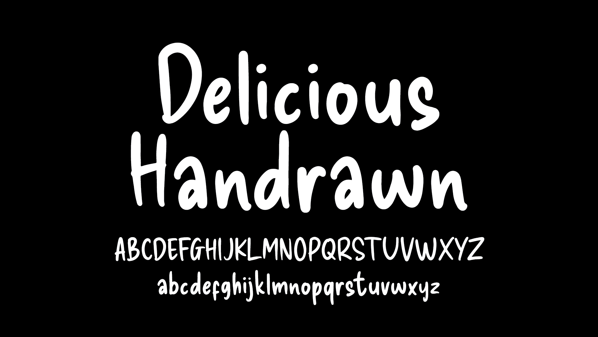

----

## About Delcious Handrawn

Delicious Handrawn is a font that was created because it was inspired by my own handwriting that I want to make a font, I started by making all the glyphs on my ipad using the procreate application, the challenge for me when making the font is my own handwriting which is not neat and it makes me have to repeat many times until I find the stroke that fits in my opinion.

## About

Agung Rohmat is font creator based on Pati, Central Java, Indonesia

## Building

Fonts are built automatically by GitHub Actions - take a look in the "Actions" tab for the latest build.

If you want to build fonts manually on your own computer:

* `make build` will produce font files.
* `make test` will run [FontBakery](https://github.com/googlefonts/fontbakery)'s quality assurance tests.
* `make proof` will generate HTML proof files.

The proof files and QA tests are also available automatically via GitHub Actions - look at https://alphArtype.github.io/Delicious.

## Fontlog

### 6 September 2022. Delicious Handrawn Version 1.000
- Opensourced.
- First public released.

## License

This Font Software is licensed under the SIL Open Font License, Version 1.1.
This license is available with a FAQ at
https://scripts.sil.org/OFL

## Repository Layout

This font repository structure is inspired by [Unified Font Repository v0.3](https://github.com/unified-font-repository/Unified-Font-Repository), modified for the Google Fonts workflow.
